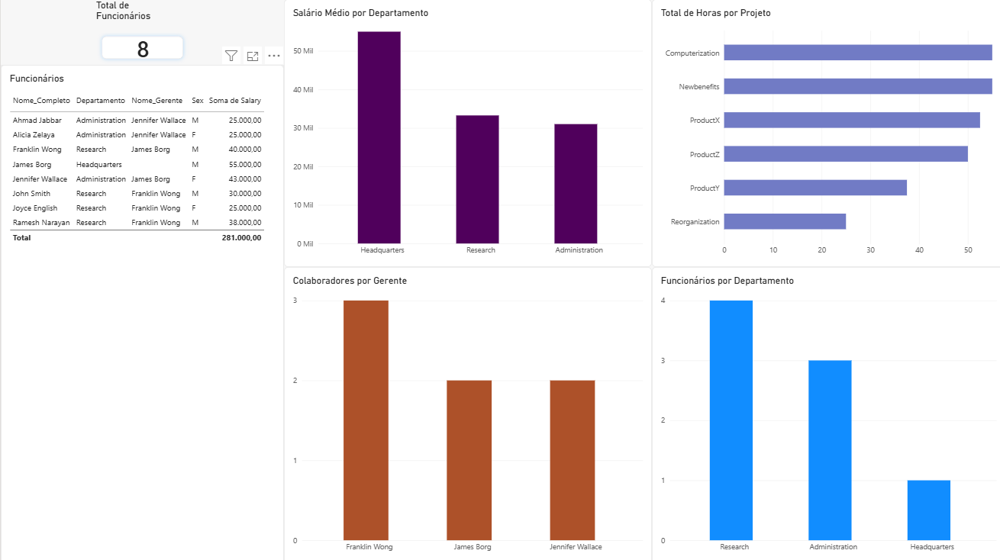

# Integração de Dados com MySQL e Power BI

Projeto desenvolvido como parte do desafio **Integrando Dados com MySQL e Transformando com Power BI**, da DIO.

O objetivo do projeto foi construir uma base de dados MySQL, realizar o processo de transformação dos dados e integrá-los ao Power BI para criação de um relatório analítico.

## Tecnologias utilizadas

- MySQL Server
- MySQL Workbench
- SQL
- Power BI Desktop
- Power Query
- GitHub

## Banco de dados

Foi utilizado o banco `company_constraints`, contendo as seguintes tabelas:

- `employee`
- `departament`
- `dept_locations`
- `project`
- `works_on`
- `dependent`

Neste projeto foi utilizado um **servidor MySQL local como alternativa à instância MySQL no Azure**.

## Transformação dos dados

Durante o desenvolvimento foram realizadas verificações e transformações nos dados, incluindo:

- Verificação dos tipos de dados;
- Tratamento e análise de valores nulos;
- Conversão dos valores de salário e horas para tipos numéricos adequados;
- Criação do nome completo dos colaboradores;
- Associação dos funcionários aos seus departamentos;
- Associação dos funcionários aos respectivos gerentes;
- Identificação de funcionários sem supervisor;
- Verificação de departamentos sem gerente;
- Associação entre departamentos e suas localizações;
- Cálculo do total de horas por projeto;
- Contagem de colaboradores por gerente.

Parte das transformações foi implementada diretamente no MySQL através de **views SQL**, posteriormente importadas para o Power BI.

## Views criadas

Foram criadas as seguintes views:

- `vw_funcionarios`
- `vw_departamento_local`
- `vw_horas_por_projeto`
- `vw_colaboradores_por_gerente`
- `vw_departamentos_gerentes`
- `vw_funcionarios_projetos`

As consultas utilizadas para criação dessas views estão disponíveis no arquivo [`script.sql`](./script.sql).

## Mesclar x Acrescentar

Para relacionar dados como funcionários, departamentos e gerentes foi utilizada a operação de **mesclagem (JOIN)**.

A mesclagem é adequada nesse cenário porque combina colunas de tabelas diferentes utilizando campos relacionados, como:

- `employee.Dno` com `departament.Dnumber`;
- `employee.Super_ssn` com `employee.Ssn`;
- `works_on.Pno` com `project.Pnumber`.

A operação de **acrescentar (append)** não seria adequada para essas situações, pois sua finalidade é adicionar as linhas de uma tabela abaixo das linhas de outra tabela com estrutura semelhante, e não relacionar registros através de chaves.

## Análise no Power BI

Após o tratamento dos dados no MySQL, as views foram importadas para o Power BI.

O relatório apresenta análises como:

- Total de funcionários;
- Funcionários por departamento;
- Total de horas por projeto;
- Quantidade de colaboradores por gerente;
- Salário médio por departamento;
- Detalhamento dos funcionários.

## Dashboard

## Arquivos

- `Desafio_MySQL_PowerBI_DIO.pbix` — relatório desenvolvido no Power BI;
- `script.sql` — consultas SQL e criação das views;
- `dashboard.png` — imagem do relatório final.

## Conclusão

O projeto permitiu praticar a integração entre banco de dados relacional e ferramentas de Business Intelligence, utilizando SQL para preparação e transformação dos dados e Power BI para análise e visualização das informações.

O fluxo utilizado no projeto foi:

**MySQL → SQL/Views → Power BI → Dashboard**
